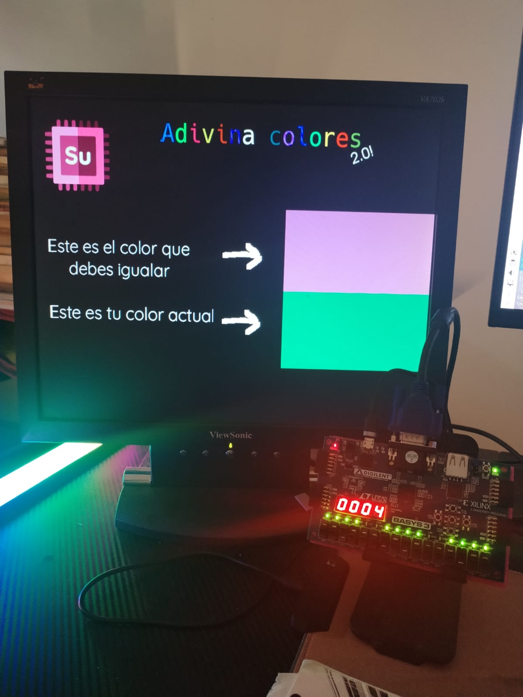
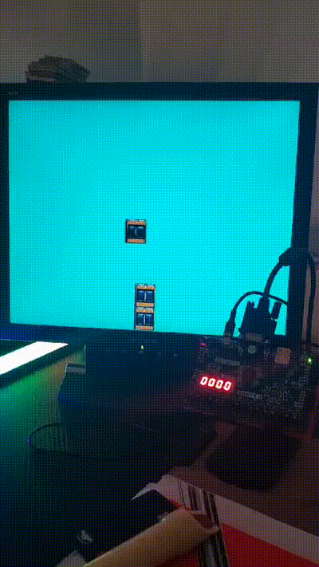

# Minki

In this repository you can find the source code for a 16-bit single core basic computer with 4096 RAM addresses and a 4096 instruction capability ROM in a Harvard micro-architecture.

The project is targetted to, and tested in the [Xilinx's Basys3 Artix-7 xc7a35tcpg236-1](https://www.xilinx.com/products/boards-and-kits/1-54wqge.html) FPGA board.

It uses a custom [instruction set architecture](ISA.md) to run programs. These programs are loaded into the FPGA board using the [assembler](Assembler/).

## What there is

### Architecture

The architecture itself is contained in the `.xpr` Vivado project found in the respective [folder](architecture_stable/).

This architecture has mapped I/O to the first RAM addresses following this table:

| Address | Associated component | Expected action |
|---------|----------------------|-----------------|
| 0       | leds                 | Output/load     |
| 1       | switches             | Input/read      |
| 2       | 7-segment-displays   | Output/load     |
| 3       | buttons              | Input/read      |
| 4       | seconds              | Input/read      |
| 5       | miliseconds          | Input/read      |
| 6       | microseconds         | Input/read      |
| 7       | Unconnected          | None            |

### Assembler

The assembler is the program that reads a `.suasm` written in the Su-Assembly language and loads it into the ROM of the board. (the execution is then immediate)

You can find a syntax highlighter in the [Visual Studio Code Marketplace](https://marketplace.visualstudio.com/items?itemName=3rdPix.suasm) for this custom assembly.

### Example projects

I also provide three different projects with games built on top of this architecture that make use of the VGA connector to display a 800x600 image for the different games.

#### Color matching game

This game challenges you to match the random color shown on the screen by guessing the proper RGB values. To adjust the color you can move the indicated switches of the FPGA board linked to red, green and blue respectively. Each with 4bit depth (a total of 4096 colors). Once you have matched the color, the screen will turn black. To start again, simply turn all the switches down and a new random color will show up on screen.

#### Tower-blocks

This game is a build-a-tower game where a block is moving constantly in the screen above a tower. You have to press the down button to let the block fall into the tower, if landed, a new block will appear. The moving block gets progressively faster and moves further away the more times you land a block. This game runs forever.

#### Su-Invaders

This WIP is based in the classic [Space Invaders](https://en.wikipedia.org/wiki/Space_Invaders). You have a spaceship that moves and can shoot spatial ammo into a group of enemy ships, the mission is to destroy them all.

